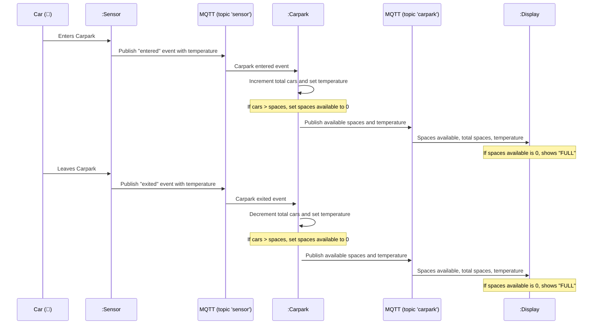

# Flow diagram of carpark events

```mermaid
sequenceDiagram
    participant Car as Car (🚗)
    participant Sensor as :Sensor
    participant MQTT_S as MQTT (topic 'sensor')
    participant Carpark as :Carpark
    participant MQTT_C as MQTT (topic 'carpark')
    participant Display as :Display

    Car->>Sensor: Enters Carpark
    Sensor->>MQTT_S: Publish "entered" event with temperature
    MQTT_S->>Carpark: Carpark entered event
    Carpark->>+Carpark: Increment total cars and set temperature
    Note over Carpark: If cars > spaces, set spaces available to 0
    Carpark->>MQTT_C: Publish available spaces and temperature
    MQTT_C->>Display: Spaces available, total spaces, temperature
    Note over Display: If spaces available is 0, shows "FULL"

    Car->>Sensor: Leaves Carpark
    Sensor->>MQTT_S: Publish "exited" event with temperature
    MQTT_S->>Carpark: Carpark exited event
    Carpark->>+Carpark: Decrement total cars and set temperature
    Note over Carpark: If cars > spaces, set spaces available to 0
    Carpark->>MQTT_C: Publish available spaces and temperature
    MQTT_C->>Display: Spaces available, total spaces, temperature
    Note over Display: If spaces available is 0, shows "FULL"
```
