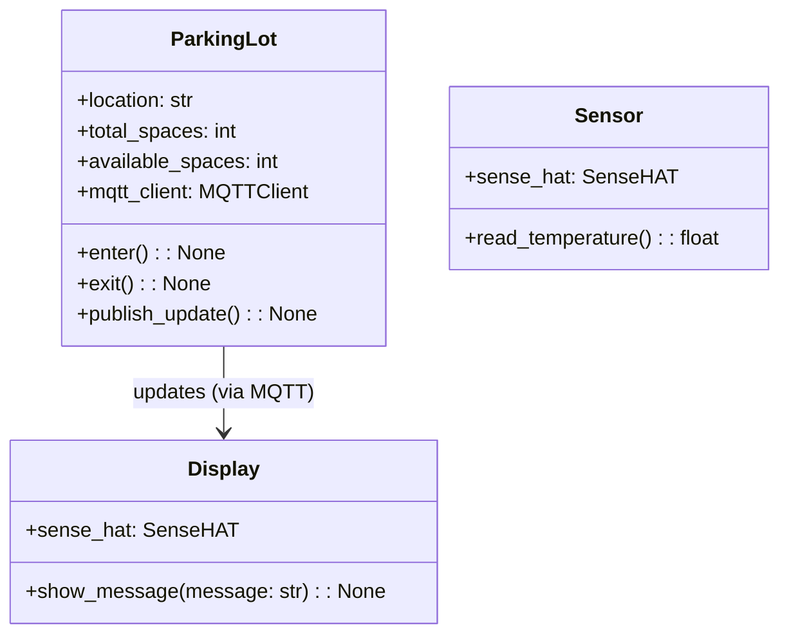

 # Agile High-Level Design (HLD) for Parking Space Availability System
> Portions generated by ChatGPT-4 prompted to act like a senior software engineer.

This high-level design provides an outline of the main objects and classes, as well as technical tips on using MQTT and the Raspberry Pi SenseHAT joystick and display. This information serves as a starting point for the junior developer responsible for implementing the code.

## Additional Requirement: PEP8 Compliance

The project must follow PEP8, the Python style guide, to ensure consistency and readability throughout the codebase.

## Objects and Classes

### Class: ParkingLot

Attributes:

- location: The parking lot's location.
- total_spaces: The total number of parking spaces.
- available_spaces: The number of available parking spaces.
- mqtt_client: The MQTT client to send and receive messages.

Methods: 
- `__init__(self, config)`: Initialize the ParkingLot object with the given configuration.
- `enter(self)`: Register a car entering the parking lot.
- `exit(self)`: Register a car leaving the parking lot.
- `publish_update(self)`: Publish an update containing available_spaces, temperature, and time.

### Class: Sensor

Attributes:

- sense_hat: The SenseHAT object to control the sensors.

Methods: 

- `__init__(self)`: Initialize the Sensor object with a SenseHAT instance.
- `read_temperature(self)`: Read the temperature from the SenseHAT sensor.

### Class: Display

Attributes:

- sense_hat: The SenseHAT object to control the LED display.

Methods: 

- `__init__(self)`: Initialize the Display object with a SenseHAT instance.
- `show_message(self, message)`: Display a message on the LED display.

## Class Diagram



## Technical Guidance

### MQTT

- Install the `paho-mqtt` library by running `pip install paho-mqtt`.
- Import the library in your code using `import paho.mqtt.client as mqtt`.
- Create an MQTT client instance: `client = mqtt.Client()`.
- Connect the client to the MQTT broker using the provided host and port: `client.connect(broker_host, broker_port)`.
- Subscribe to a topic to receive messages: `client.subscribe("topic_name")`.
- Define a callback function to handle received messages: `def on_message(client, userdata, message): ....`
- Assign the callback function to the client: `client.on_message = on_message`.
- Start the client loop to process network traffic: `client.loop_start()`.

### SenseHAT Joystick

- Import the SenseHAT library: `from sense_hat import SenseHat`.
- Create a SenseHAT instance: `sense = SenseHat()`.
- Define a function to handle joystick events: `def handle_joystick(event): ....`
- Check the event's action (e.g., `event.action == "pressed"`) and direction (e.g., `event.direction == "up"`).
- Register the function as an event handler: `sense.stick.direction_up = handle_joystick`.

### SenseHAT Display

- Use the `sense.show_message()` method to display text on the LED display (e.g., `sense.show_message("Hello, World!")`).
- Configure the text scroll speed, text color, and background color using optional parameters:
For example: `sense.show_message("Hello, World!", scroll_speed=0.1, text_colour=(255, 255, 255), back_colour=(0, 0, 0))`).

## PEP8 Examples

### Separate words with underscores

Incorrect:

```python

def someFunction():
    return

someVariable = 42
```

Correct:

```python

def some_function():
    return

some_variable = 42
```

### Use full English words wherever possible, not contractions

Incorrect:

```python

def calc_avg(numbers):
    return sum(numbers) / len(numbers)

temp = calc_avg([1, 2, 3])
```

Correct:

```python

def calculate_average(numbers):
    return sum(numbers) / len(numbers)

temperature = calculate_average([1, 2, 3])
```

### Do not put a space between a function name and the bracket

Incorrect:

```python

def some_function ():
    return
```

Correct:

```python

def some_function():
    return
```

## Configuration File Parsing

> **Lecturer's note**: There is a lot of flexibility here. The key is that the configuration *must* be in a text file and it *must* have an attribute value format of some kind.

To parse the TOML configuration file, follow these steps:

1. Install the `tomli` library by running `pip install tomli`.
2. Import the library in your code using `import tomli`.
3. Read the contents of the configuration file into a string.
4. Use the `tomli.loads()` method to parse the string and create a dictionary.

Note: In 3.11, toml (tomllib) is built in, see:
[python docs](https://docs.python.org/3/library/tomllib.html)
Example:

```python

import tomli

with open("config.toml", "r") as file:
    config_string = file.read()

config = tomli.loads(config_string)
```

The resulting `config` dictionary can then be used to initialize the `ParkingLot`, `Sensor`, and `Display` objects.

## Sensor Class

To encapsulate the SenseHAT, create a `Sensor` class:

Class: Sensor
Attributes:

- sense_hat: The SenseHAT object to access the sensor data.

Methods:

- `__init__(self)`: Initialize the Sensor object with a SenseHAT instance.
- `get_temperature(self)`: Retrieve the current temperature from the SenseHAT.

Example:

```python

from sense_hat import SenseHat

class Sensor:
    def __init__(self):
        self.sense_hat = SenseHat()

    def get_temperature(self):
        return self.sense_hat.get_temperature()
```

## Test Cases

For the unittest module, you can create test cases that cover the parsing of the configuration file and the logic of the parking lot. Here are some example test cases:

1. Test that the configuration file is parsed correctly:

```python

import unittest
import tomli
from parking_lot import parse_config

class TestConfigParsing(unittest.TestCase):
    def test_parse_config(self):
        config_string = '''
        [parking_lot]
        location = "Moondalup City Square Parking"
        total_spaces = 192
        broker_host = "localhost"
        broker_port = 1883
        '''
        config = tomli.loads(config_string)
        parking_lot = parse_config(config)
        self.assertEqual(parking_lot.location, "Moondalup City Square Parking")
        self.assertEqual(parking_lot.total_spaces, 192)
```

2. Test that the available spaces do not go below zero:

```python

import unittest
from parking_lot import ParkingLot

class TestParkingLot(unittest.TestCase):
    def test_no_negative_spaces(self):
        parking_lot = ParkingLot("Test Location", 2, "localhost", 1883)
        parking_lot.available_spaces = 0
        parking_lot.enter()
        parking_lot.enter()
        self.assertEqual(parking_lot.available_spaces, 0)
        parking_lot.exit()
        parking_lot.exit()
        parking_lot.exit()
        self.assertEqual(parking_lot.available_spaces, 1)
```


## Alternative: If You Don't Have a SenseHAT

Replace the SenseHAT with a Tkinter-based interface for simulating joystick events and displaying the parking lot information. 

> **Lecturer's note**: code `no_pi.py` has already been provided that implements a more advanced version of this for you.

### Dependencies

For this alternative, there is no need for a Sensor class, as the temperature and other sensor data will be simulated.

### Display Class

Replace the Display class with a Tkinter-based class (starting code has been included).

Class: TkinterDisplay

Attributes:
- root: The Tkinter root window.
- label: The Tkinter label to display the parking lot information.

Methods: 
- `__init__(self)`: Initialize the TkinterDisplay object.
- `show_message(self, message)`: Display a message on the Tkinter label.

Example:

```python

import tkinter as tk

class TkinterDisplay:
    def __init__(self):
        self.root = tk.Tk()
        self.label = tk.Label(self.root, text="", width=50, height=5)
        self.label.pack()

    def show_message(self, message):
        self.label.config(text=message)
        self.root.update()
```

### Joystick Events Simulation

Use Tkinter buttons to simulate joystick events, such as "enter" and "exit" for the parking lot.

```python

def on_enter_button_click():
    parking_lot.enter()

def on_exit_button_click():
    parking_lot.exit()

enter_button = tk.Button(root, text="Enter", command=on_enter_button_click)
exit_button = tk.Button(root, text="Exit", command=on_exit_button_click)
enter_button.pack()
exit_button.pack()
```

## Alternative 2: Text File for for Screen Reader Compatibility

Create an alternative solution where the parking lot information is updated in a text file, allowing access to the information using a screen reader.

### Text Display Class

Replace the Display class with a class that writes the parking lot information to a text file.

Class: TextFileDisplay
Attributes:

- file_path: The path to the text file.

Methods:

- `__init__(self, file_path)`: Initialize the TextFileDisplay object with the given file path.
- `show_message(self, message)`: Write the parking lot information to the text file.

Example:

```python

class TextFileDisplay:
    def __init__(self, file_path):
        self.file_path = file_path

    def show_message(self, message):
        with open(self.file_path, "w") as file:
            file.write(message)
```

### Joystick Events Simulation From Console Input

For this alternative, simulate joystick events by reading user input from the console.

```python

while True:
    action = input("Enter 'e' for car entering, 'x' for car exiting, or 'q' to quit: ").lower()
    if action == 'e':
        parking_lot.enter()
    elif action == 'x':
        parking_lot.exit()
    elif action == 'q':
        break
```
